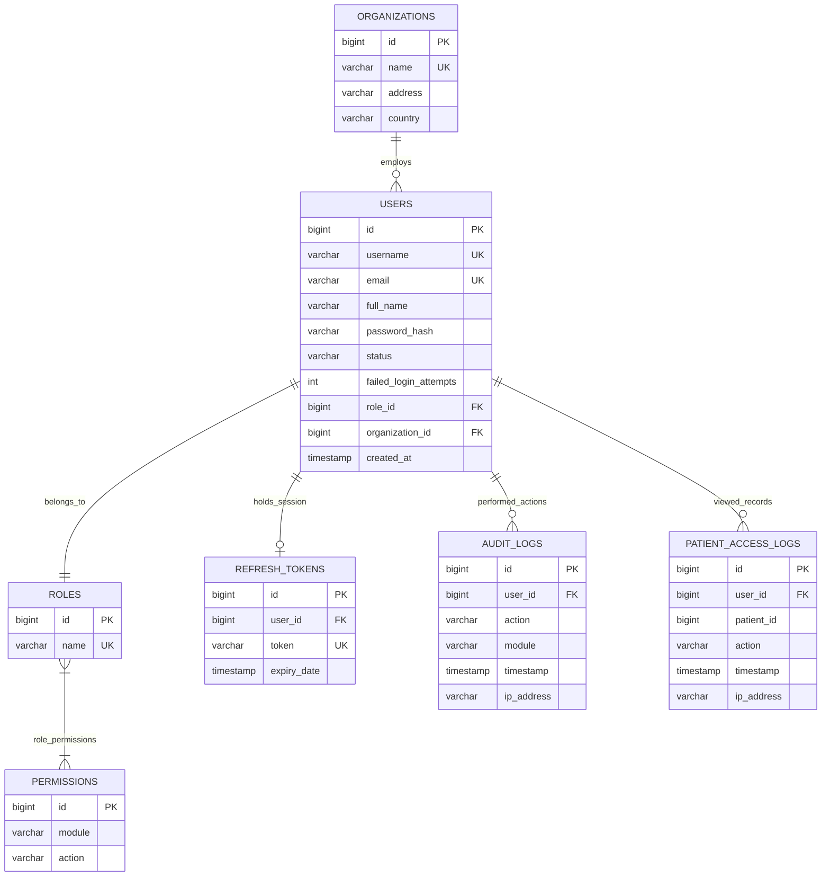
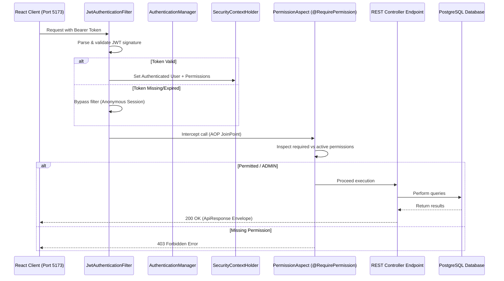
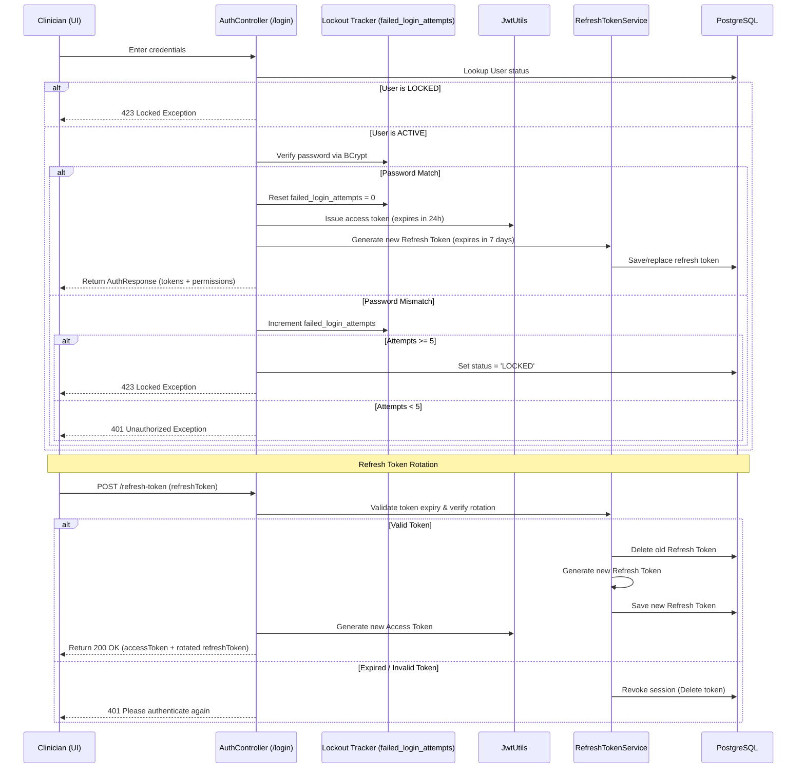

# Lanka EMR: AI-Ready Electronic Medical Record Platform

Lanka EMR is a modern, enterprise-grade Electronic Medical Record (EMR) platform designed for healthcare providers in Sri Lanka (and scalable to India and South Asia). It serves as a secure, modular, and AI-ready alternative to legacy systems.

---

## 1. Project Folder Structure

### Frontend Structure (Vite + TypeScript + Tailwind CSS)
Located in `frontend/src/`:
- **`api/`**: Axios configuration and endpoints.
- **`layouts/`**: `DashboardLayout.tsx` which handles core side and top navigation.
- **`pages/`**: Page views (Overview, Patients, Appointments, Consultations, Lab, Pharmacy, Billing, Reports, AI Co-Pilot, User Management, Security).
- **`routes/`**: Guards (`ProtectedRoute.tsx`) and mapping dictionary (`AppRoutes.tsx`).
- **`store/`**: Authentication context state (`AuthContext.tsx`).
- **`types/`**: TypeScript domain interfaces (`index.ts`).

### Backend Structure (Spring Boot + Maven)
Located in `backend/src/main/java/com/emr/platform/`:
- **`auth/`**: Core security configurations, JWT filters, authentication controller, and DTOs.
- **`user/`**: Clinician accounts, directories, profile query endpoints.
- **`role/`**: User role entity definitions (ADMIN, DOCTOR, NURSE, RECEPTIONIST).
- **`permission/`**: Action-based privilege attributes.
- **`audit/`**: System interactions audit logging.
- **`common/`**: General REST envelope, seeder data compiler, exceptions controller.

---

## 2. Database Schema Overview (PostgreSQL)

The platform maps entities with relational mappings using Hibernate/JPA:



---

## 3. Security Architecture Diagram

The diagram below details the Spring Security pipeline, filter chains, and AOP validation intercepts:



---

## 4. Authentication & Refresh Token Rotation Flow

The diagram below maps credentials verification, brute force lockout, and refresh token rotation:



---

## 5. REST API Documentation

All API response payloads use a uniform JSON wrapper:
```json
{
  "success": true,
  "message": "Request completed successfully",
  "data": { ... },
  "timestamp": 178512910291
}
```

### Authentication endpoints (`/api/auth`)

- **`POST /api/auth/login`**:
  - Request body: `LoginRequest` (username, password)
  - Returns `AuthResponse`: `{ accessToken, refreshToken, userId, username, role, permissions }`
  - Locks user status to `LOCKED` on 5 consecutive bad passwords.

- **`POST /api/auth/register`**:
  - Request body: `RegisterRequest` (username, email, fullName, role, password)
  - Enforces password complexity rules (length >= 8, uppercase, lowercase, digit, special character).

- **`POST /api/auth/refresh-token`**:
  - Request body: `TokenRefreshRequest` (refreshToken)
  - Revokes old token, rotates to new refresh token, and returns new access/refresh tokens.

- **`POST /api/auth/logout`**:
  - Revokes active sessions and deletes refresh tokens from database.

---

## 6. Setup & Launch Instructions

### Prerequisites
1. **Java Development Kit (JDK) 17** configured in the PATH.
2. **Node.js (v18+)** and **npm** installed.
3. **PostgreSQL** database service running locally.

### Database Setup
Create a PostgreSQL database named `oscar_emr`:
```sql
CREATE DATABASE oscar_emr;
```

### Backend (Spring Boot)
1. Configure credentials in `backend/src/main/resources/application.yml` or set environment variables:
   - `DB_URL`: JDBC url (default: `jdbc:postgresql://localhost:5432/oscar_emr`)
   - `DB_USERNAME`: Database username (default: `postgres`)
   - `DB_PASSWORD`: Database password (default: `password`)
2. Run the application using Maven:
   ```bash
   cd backend
   mvn spring-boot:run
   ```
   *Note: The seeder creates a default Organization "Colombo Medical Center" and seeds Admin, Doctor, Nurse, and Receptionist profiles associated with it.*

### Frontend (Vite + React)
1. Install dependencies:
   ```bash
   cd frontend
   npm install
   ```
2. Launch Vite development server:
   ```bash
   npm run dev
   ```
   *Note: Access the frontend at `http://localhost:5173/`. You can log in using real API calls if the backend is running, or bypass database setup instantly by clicking any "Quick Demo Login" button.*
